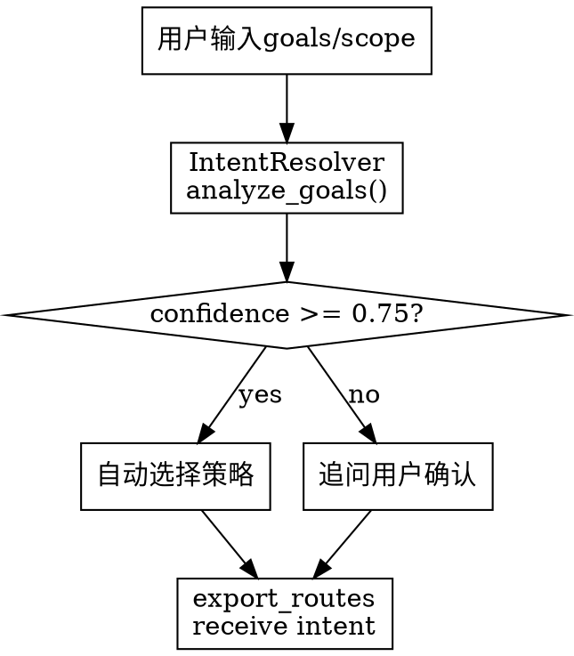

# Business Blueprint Schema 重构方案 v2（基于对抗性评审）

**文档版本**：v2 (Actionable)  
**创建日期**：2026-04-25  
**基于**：Codex对抗性评审结果  
**状态**：待实施

---

## 一、致命缺陷回顾（来自Codex评审）

### 🔴 缺陷1：主痛点未被解决

**问题**：策略可配置 ≠ 用户能拿到对的蓝图

- 产品经理执行 `--export` 时，不知道 `product-capability` 这种策略名
- 系统只能走隐藏默认策略 + fallback
- 渲染路由不受"用户意图"约束
- **结果**：期望产品蓝图，可能仍得到泳道图

**根本原因**：我把"专业性"等同于"可配置性"，但用户根本不会主动配置。

---

### 🔴 缺陷2：架构空洞 - 可扩展策略只是关键词表

**问题**：承诺了"策略可继承组合"，实际只有 `layers + keywords + fallback`

- 真实场景："支付风控网关"同时符合3个视角（产品网关层、金融风控层、技术API网关）
- 无合并语义、置信度、冲突解释
- 输出随机依赖关键词先后顺序

**根本原因**：用裸关键词匹配替代了真正的规则引擎。

---

### 🔴 缺陷3：三套事实来源 + 无迁移方案

**问题**：同时新建 `layer-strategies.md`、`industry-practices.md`、JSON配置，但：
- 谁是权威？未定义
- 旧蓝图如何映射？无迁移
- 策略是蓝图级还是导出级？留作开放问题

**根本原因**：先改文档、后改代码、缺兼容基线，会造成"文档说一套、配置跑一套"。

---

## 二、核心设计修正

### 修正1：意图解析作为一等公民（替代"用户手工选策略"）

**设计原则**：
- 默认 `mode=auto`：系统根据用户目标文本（goals）自动判定意图
- 低置信度时才追问用户
- `export_routes.py` 必须接收 intent，而非只看 systems/flowSteps

**数据结构**：

```json
{
  "editor": {
    "blueprintIntent": {
      "primary": "product",        // 主视角：product/technical/business/data/organizational
      "secondary": "finance",      // 行业 overlay（可选）
      "mode": "auto"               // auto/manual
    },
    "strategySelection": {
      "selected": "product-capability",
      "source": "auto",            // auto/manual/cli
      "reason": "goal mentions 产品规划/能力边界",
      "confidence": 0.88,
      "reviewNeeded": false       // confidence < 0.75 → true
    },
    "customLayers": []             // 用户自定义层（可选）
  }
}
```

**工作流**：



---

### 修正2：基础视角 + 行业 Overlay 二层架构（替代任意策略组合）

**架构设计**：

```
Perspectives（基础视角）
├── product-capability       # 产品能力分层
├── technical-architecture   # 技术调用链路
├── business-domain          # 业务域划分
├── data-governance          # 数据生命周期
└── organizational           # 组织架构
    │
    ↓ 可叠加行业 Overlay
    │
Overlays（行业叠加）
├── finance-regulatory       # 金融监管
├── manufacturing-supply-chain # 制造业供应链
├── retail-operations        # 零售运营
└── healthcare-compliance    # 医疗合规
```

**规则引擎设计**：

```json
// Perspective: product-capability（基础视角）
{
  "strategyId": "product-capability",
  "kind": "perspective",
  "version": "1.0",
  "rules": [
    {
      "layer": "user-entry",
      "layerName": "用户接入层",
      "signals": [
        {"type": "category", "values": ["frontend"], "weight": 100},
        {"type": "nameKeyword", "values": ["客户端", "APP", "Portal"], "weight": 80}
      ],
      "minScore": 60,
      "description": "用户访问系统的入口层"
    },
    {
      "layer": "gateway",
      "layerName": "服务网关层",
      "signals": [
        {"type": "category", "values": ["gateway"], "weight": 100},
        {"type": "nameKeyword", "values": ["网关", "Gateway", "API网关"], "weight": 80}
      ],
      "minScore": 60
    }
  ],
  "conflictPolicy": "highest_score",
  "fallbackLayer": "core-business",
  "reviewThreshold": 0.75
}
```

```json
// Overlay: finance-regulatory（行业叠加）
{
  "overlayId": "finance-regulatory",
  "appliesTo": ["product-capability", "technical-architecture"],
  "version": "1.0",
  "adjustments": [
    {
      "layer": "risk-control",
      "layerName": "风险控制层",
      "signals": [
        {"type": "nameKeyword", "values": ["风控", "风险评估", "预警"], "weight": 120}
      ],
      "scoreDelta": 30,  // 叠加得分
      "overrideIf": "score_above_150"  // 高置信度时强制覆盖
    },
    {
      "layer": "regulatory",
      "layerName": "监管合规层",
      "signals": [
        {"type": "nameKeyword", "values": ["合规", "审计", "监管"], "weight": 120}
      ],
      "scoreDelta": 40
    }
  ]
}
```

**合并规则**：

1. **Perspective先判定**：计算每个系统的各层得分
2. **Overlay叠加**：如果蓝图有 `secondary: "finance"`，叠加 `finance-regulatory` 的 adjustments
3. **冲突解决**：
   - 默认：`highest_score`（最高得分层）
   - 可配置：`overrideIf`（特定条件强制覆盖）
4. **低置信度标记**：`score < reviewThreshold → reviewNeeded: true`

---

### 修正3：Phase 0 兼容基线 + 迁移方案（必须排在最前）

**Phase 0: 兼容基线与迁移设计**

#### 0.1 冻结 Golden Fixtures

```bash
# 创建测试基线目录
mkdir -p scripts/business_blueprint/fixtures/golden_v1/

# 选择代表性蓝图（10-20个）
fixtures=(
  "demos/solution.blueprint.json"
  "demos/finance.exports/finance.blueprint.json"
  "demos/manufacturing.exports/manufacturing.blueprint.json"
  "demos/retail.exports/retail.blueprint.json"
)

# 记录当前输出快照
for f in $fixtures; do
  python scripts/business_blueprint/cli.py --export $f --format svg
  cp ${f%.blueprint.json}.exports/*.svg scripts/business_blueprint/fixtures/golden_v1/
  cp ${f%.blueprint.json}.exports/*.html scripts/business_blueprint/fixtures/golden_v1/
done
```

#### 0.2 创建迁移器

```python
# scripts/business_blueprint/migrations/v1_to_v2.py

def infer_legacy_strategy(blueprint: dict) -> dict:
    """从旧蓝图推断意图和策略"""
    systems = blueprint.get("library", {}).get("systems", [])
    goals = blueprint.get("context", {}).get("goals", [])

    # 简单推断规则
    if any("产品" in g for g in goals):
        intent = {"primary": "product", "mode": "auto"}
        strategy = "product-capability"
    elif any("技术" in g for g in goals) or any(s.get("category") == "layer" for s in systems):
        intent = {"primary": "technical", "mode": "auto"}
        strategy = "technical-architecture"
    else:
        intent = {"primary": "product", "mode": "auto"}  # 默认
        strategy = "product-capability"

    return {
        "blueprintIntent": intent,
        "strategySelection": {
            "selected": strategy,
            "source": "migration",
            "reason": "migrated from v1 blueprint",
            "confidence": 0.70,
            "reviewNeeded": True
        }
    }

def migrate_blueprint_v1_to_v2(blueprint: dict) -> dict:
    """迁移旧蓝图到v2格式"""
    blueprint.setdefault("editor", {})

    # 迁移意图和策略
    if "blueprintIntent" not in blueprint["editor"]:
        migration = infer_legacy_strategy(blueprint)
        blueprint["editor"]["blueprintIntent"] = migration["blueprintIntent"]
        blueprint["editor"]["strategySelection"] = migration["strategySelection"]

    # 保留旧的 category/layer 字段（向后兼容）
    # 新系统会优先使用 strategySelection，fallback 到旧字段

    return blueprint

# 批量迁移
def batch_migrate(input_dir: str, output_dir: str):
    for bp_file in Path(input_dir).glob("**/*.blueprint.json"):
        blueprint = json.load(open(bp_file))
        migrated = migrate_blueprint_v1_to_v2(blueprint)
        Path(output_dir).mkdir(parents=True, exist_ok=True)
        json.dump(migrated, open(Path(output_dir) / bp_file.name, "w"), indent=2)
```

#### 0.3 双跑比对验证

```python
# scripts/business_blueprint/tests/migration_validation.py

def validate_migration(fixture_path: str):
    """验证迁移后输出一致"""
    old_blueprint = json.load(open(fixture_path))
    migrated_blueprint = migrate_blueprint_v1_to_v2(old_blueprint)

    # 导出旧版本
    old_export = export_svg(old_blueprint, "/tmp/old.svg")

    # 导出新版本（用迁移后的意图）
    new_export = export_svg(migrated_blueprint, "/tmp/new.svg")

    # 比对SVG结构差异
    old_svg = parse_svg("/tmp/old.svg")
    new_svg = parse_svg("/tmp/new.svg")

    # 允许的变更：新增意图字段，分层逻辑改进
    # 不允许：系统归属层完全错位、泳道变成海报

    diff = compare_svg_structure(old_svg, new_svg)
    assert diff.layer_changes < 0.2, "20%以上系统换了层，迁移失败"
    assert diff.route == old_svg.route, "路由完全变化，迁移失败"

    return diff
```

---

## 三、实施步骤（修正版）

### Phase 0：兼容基线 + 迁移设计（NEW - 必须最先）

**目标**：确保重构不破坏现有输出，定义迁移路径

**步骤**：

0.1 **冻结 Golden Fixtures**（1天）
- 选择10-20个代表性蓝图
- 记录当前SVG/HTML输出快照
- 建立自动化比对工具

0.2 **创建迁移器**（1天）
- 实现 `infer_legacy_strategy()`：从旧蓝图推断意图
- 实现 `migrate_blueprint_v1_to_v2()`：回填意图字段
- 编写迁移测试：确保输出一致性

0.3 **双跑比对验证**（1天）
- 批量迁移所有现有蓝图
- 对比新旧输出差异
- 允许改进，不允许回归

---

### Phase 1：意图解析器 + 规则引擎

**目标**：把意图解析作为核心，替代"用户手工选策略"

**步骤**：

1.1 **创建意图解析器**（2天）
- 实现 `IntentResolver` 类
- 分析 `goals`、`scope`、`sourceRefs` 推断意图
- 置信度计算：关键词匹配 + TF-IDF + 启发式规则
- 低置信度追问机制：生成澄清问题

```python
# scripts/business_blueprint/intent_resolver.py

class IntentResolver:
    def analyze_goals(self, goals: list[str]) -> dict:
        """分析用户目标，推断蓝图意图"""
        # 词汇匹配
        product_keywords = ["产品", "能力", "功能", "价值"]
        technical_keywords = ["架构", "技术", "调用", "链路"]
        business_keywords = ["业务域", "CRM", "ERP", "OA"]

        scores = {
            "product": sum(1 for g in goals if any(k in g for k in product_keywords)),
            "technical": sum(1 for g in goals if any(k in g for k in technical_keywords)),
            "business": sum(1 for g in goals if any(k in g for k in business_keywords))
        }

        primary = max(scores, key=scores.get)
        confidence = scores[primary] / len(goals) if goals else 0.5

        return {
            "primary": primary,
            "mode": "auto",
            "confidence": confidence
        }

    def detect_industry_overlay(self, goals: list[str]) -> str | None:
        """检测行业叠加"""
        industry_keywords = {
            "finance": ["金融", "银行", "风控", "合规"],
            "manufacturing": ["制造", "工厂", "供应链", "MES"],
            "retail": ["零售", "门店", "POS"]
        }

        for industry, keywords in industry_keywords.items():
            if any(any(k in g for k in keywords) for g in goals):
                return industry

        return None
```

1.2 **创建规则引擎**（2天）
- 实现 `RuleEngine` 类
- 加载 Perspective + Overlay 配置
- 计算每个系统的各层得分
- 冲突解决：`highest_score` 或 `overrideIf`

```python
# scripts/business_blueprint/rule_engine.py

class RuleEngine:
    def __init__(self, perspective: str, overlay: str | None = None):
        self.perspective = load_perspective(perspective)
        self.overlay = load_overlay(overlay) if overlay else None

    def assign_layer(self, system: dict) -> dict:
        """计算系统归属层"""
        scores = {}

        # Perspective得分
        for rule in self.perspective["rules"]:
            score = 0
            for signal in rule["signals"]:
                if signal["type"] == "category":
                    if system.get("category") in signal["values"]:
                        score += signal["weight"]
                elif signal["type"] == "nameKeyword":
                    if any(k in system["name"] for k in signal["values"]):
                        score += signal["weight"]

            if score >= rule["minScore"]:
                scores[rule["layer"]] = score

        # Overlay叠加得分
        if self.overlay:
            for adjustment in self.overlay["adjustments"]:
                base_score = scores.get(adjustment["layer"], 0)
                # 检查叠加条件
                if self._check_signals(system, adjustment["signals"]):
                    scores[adjustment["layer"]] = base_score + adjustment["scoreDelta"]

        # 选择最高得分层
        if scores:
            best_layer = max(scores, key=scores.get)
            confidence = scores[best_layer] / 150  # 归一化
            review_needed = confidence < self.perspective["reviewThreshold"]
        else:
            best_layer = self.perspective["fallbackLayer"]
            confidence = 0.5
            review_needed = True

        return {
            "layer": best_layer,
            "score": scores.get(best_layer, 0),
            "confidence": confidence,
            "reviewNeeded": review_needed
        }
```

1.3 **修改导出路由**（1天）
- `export_routes.py` 接收 `intent` 参数
- 根据 `blueprintIntent.primary` 选择 Perspective
- 根据 `blueprintIntent.secondary` 选择 Overlay
- 低置信度时使用 `freeflow`（保守路由）

```python
# scripts/business_blueprint/export_routes.py

def decide_route(blueprint: dict, intent: dict | None = None) -> ExportRouteDecision:
    systems = blueprint.get("library", {}).get("systems", [])
    flow_steps = blueprint.get("library", {}).get("flowSteps", [])

    # 新逻辑：优先考虑意图
    if intent:
        strategy_selection = blueprint.get("editor", {}).get("strategySelection", {})
        confidence = strategy_selection.get("confidence", 1.0)

        # 低置信度 → 保守路由
        if confidence < 0.75:
            return ExportRouteDecision("freeflow", "low confidence intent", "error")

        # 高置信度 → 按意图选择
        primary = intent.get("primary", "product")
        if primary in ["product", "business"]:
            # 产品/业务视角 → poster/hierarchy
            if len(systems) >= 4 and any(s.get("category") == "layer" for s in systems):
                return ExportRouteDecision("poster", f"{primary} blueprint", "freeflow")
        elif primary == "technical":
            # 技术视角 → architecture-template
            return ExportRouteDecision("architecture-template", "technical blueprint", "freeflow")

    # Fallback：旧逻辑（兼容未迁移蓝图）
    # ... 保持现有逻辑 ...
```

---

### Phase 2：配置文件系统 + 注册表

**目标**：建立唯一可执行真相源，避免三套事实

**步骤**：

2.1 **创建策略注册表**（1天）
- 目录：`scripts/business_blueprint/strategy_registry/`
- Perspectives: `perspectives/*.json`
- Overlays: `overlays/*.json`
- 注册表是唯一可执行真相

```
scripts/business_blueprint/strategy_registry/
├── perspectives/
│   ├── product-capability.json
│   ├── technical-architecture.json
│   ├── business-domain.json
│   ├── data-governance.json
│   └── organizational.json
├── overlays/
│   ├── finance-regulatory.json
│   ├── manufacturing-supply-chain.json
│   ├── retail-operations.json
│   └── healthcare-compliance.json
└── registry.json  # 注册索引（元数据）
```

2.2 **定义策略配置格式**（1天）
- Perspectives格式：见上文"修正2"
- Overlays格式：见上文"修正2"
- Registry格式：元数据索引

```json
// registry.json
{
  "perspectives": [
    {
      "id": "product-capability",
      "name": "产品能力分层",
      "version": "1.0",
      "file": "perspectives/product-capability.json",
      "description": "按产品价值层次分层",
      "useCases": ["产品规划", "能力地图"]
    }
  ],
  "overlays": [
    {
      "id": "finance-regulatory",
      "name": "金融监管叠加",
      "appliesTo": ["product-capability", "technical-architecture"],
      "file": "overlays/finance-regulatory.json",
      "description": "叠加金融监管和风控层"
    }
  ]
}
```

2.3 **文档由注册表生成**（1天）
- `layer-strategies.md`：由 registry.json 生成（目录清单）
- `industry-practices.md`：只保留叙述性 rationale，不放规则
- 避免手写文档和配置漂移

```python
# scripts/business_blueprint/tools/generate_docs.py

def generate_layer_strategies_md():
    """从注册表生成策略目录文档"""
    registry = load_registry()

    md_content = "# 分层策略目录\n\n"
    md_content += "本文档由 `strategy_registry/registry.json` 自动生成，请勿手工编辑。\n\n"

    md_content += "## Perspectives（基础视角）\n\n"
    for p in registry["perspectives"]:
        md_content += f"- **{p['name']}** ({p['id']})\n"
        md_content += f"  - 适用场景：{p['useCases']}\n"
        md_content += f"  - 说明：{p['description']}\n\n"

    md_content += "## Overlays（行业叠加）\n\n"
    for o in registry["overlays"]:
        md_content += f"- **{o['name']}** ({o['id']})\n"
        md_content += f"  - 可叠加于：{o['appliesTo']}\n"
        md_content += f"  - 说明：{o['description']}\n\n"

    write_file("references/layer-strategies.md", md_content)
```

---

### Phase 3：CLI支持 + 验证工具

**目标**：提供验证护栏，降低自定义门槛

**步骤**：

3.1 **CLI支持意图参数**（1天）

```bash
# 自动模式（默认）
python scripts/business_blueprint/cli.py --export blueprint.json

# 手动指定意图
python scripts/business_blueprint/cli.py --export blueprint.json \
  --intent primary=product,secondary=finance

# 强制策略（覆盖自动推断）
python scripts/business_blueprint/cli.py --export blueprint.json \
  --strategy product-capability
```

3.2 **策略预览工具**（1天）

```bash
# 预览分层结果（不导出）
python scripts/business_blueprint/cli.py --strategy-preview blueprint.json

# 输出
{
  "intent": {"primary": "product", "confidence": 0.88},
  "strategy": "product-capability",
  "layerAssignments": [
    {"system": "客户端层", "layer": "user-entry", "score": 100, "confidence": 1.0},
    {"system": "网关层", "layer": "gateway", "score": 80, "confidence": 0.85},
    {"system": "支付风控网关", "layer": "risk-control", "score": 150, "confidence": 0.95, "reviewNeeded": false}
  ],
  "reviewNeeded": false
}
```

3.3 **策略验证工具**（1天）

```bash
# 验证自定义策略
python scripts/business_blueprint/cli.py --strategy-lint custom-strategy.json

# 输出
✅ Perspective格式正确
✅ Rules定义完整
⚠️  建议：risk-control层缺少minScore定义
❌ 错误：signals权重总和不足60（最低阈值）
```

---

### Phase 4：行业实践扩展

**目标**：提供行业最佳实践模板（基于验证）

**步骤**：

4.1 **提供行业实践模板**（2天）
- 每个行业：Perspective + Overlay + Fixture验证
- 金融：`finance-regulatory.json` + `finance.blueprint.json` fixture
- 制造：`manufacturing-supply-chain.json` + `manufacturing.blueprint.json` fixture
- 零售：`retail-operations.json` + `retail.blueprint.json` fixture

4.2 **行业实践文档**（1天）
- 只保留叙述性 rationale
- 引用fixture示例
- 不放任何可执行规则

---

## 四、数据结构完整定义

### Blueprint Editor 字段扩展

```json
{
  "editor": {
    // 意图（核心）
    "blueprintIntent": {
      "primary": "product",        // 必填：product/technical/business/data/organizational
      "secondary": "finance",      // 可选：行业overlay ID
      "mode": "auto"               // 必填：auto/manual
    },

    // 策略选择（解析结果）
    "strategySelection": {
      "selected": "product-capability",  // 最终策略
      "source": "auto",                  // auto/manual/cli/migration
      "reason": "goal mentions 产品规划",
      "confidence": 0.88,
      "reviewNeeded": false              // 低置信度标记
    },

    // 用户自定义层（可选）
    "customLayers": [
      {
        "id": "custom-1",
        "name": "供应链管理层",
        "signals": [
          {"type": "nameKeyword", "values": ["供应商", "采购"], "weight": 100}
        ]
      }
    ],

    // 向后兼容：保留旧字段
    "layerStrategy": "product-capability",  // deprecated
    "theme": "enterprise-default",
    "fieldLocks": {}
  }
}
```

---

## 五、用户场景验证（基于修正设计）

### 场景1：产品经理生成产品蓝图

**用户做什么**：
```bash
python scripts/business_blueprint/cli.py --plan blueprint.json --from "产品规划：展示云之家产品能力架构"
python scripts/business_blueprint/cli.py --export blueprint.json
```

**系统做什么**：
1. IntentResolver分析goals："产品规划"、"产品能力" → `primary=product, confidence=0.88`
2. 自动选择 `product-capability` Perspective
3. RuleEngine计算每个系统的层级得分
4. export_routes接收 intent → 选择 `poster` 路由
5. 输出产品蓝图（分层的架构图）

**Does it work? ✅ Yes**
- 用户无需知道策略名
- 系统自动判定意图
- 高置信度直接导出
- 低置信度会追问（如goals模糊）

---

### 场景2：技术架构评审

**用户做什么**：
```bash
python scripts/business_blueprint/cli.py --export blueprint.json \
  --intent primary=technical
```

**系统做什么**：
1. 手动指定 `primary=technical`
2. 选择 `technical-architecture` Perspective
3. RuleEngine按技术调用链路分层（Frontend→Backend→Database）
4. export_routes选择 `architecture-template` 路由
5. 输出技术架构图

**Does it work? ✅ Yes**
- 用户显式指定意图（技术评审场景通常是专家）
- 系统按技术视角分层
- 输出技术蓝图

---

### 场景3：制造业供应链蓝图

**用户做什么**：
```bash
python scripts/business_blueprint/cli.py --plan blueprint.json --from "制造业供应链蓝图"
python scripts/business_blueprint/cli.py --export blueprint.json
```

**系统做什么**：
1. IntentResolver分析goals："制造业"、"供应链" → `primary=product, secondary=manufacturing, confidence=0.75`
2. 选择 `product-capability` Perspective + `manufacturing-supply-chain` Overlay
3. RuleEngine叠加得分：
   - "供应商管理" → signals匹配manufacturing overlay → scoreDelta +30 → 供应商管理层
   - "生产车间" → signals匹配manufacturing overlay → 生产执行层
4. export_routes选择 `poster` 路由
5. 输出制造业供应链蓝图

**Does it work? ✅ Yes**
- 系统自动识别行业overlay
- Perspective + Overlay二层组合
- 输出行业特定蓝图

---

### 场景4：金融产品蓝图（冲突场景）

**用户做什么**：
```bash
python scripts/business_blueprint/cli.py --plan blueprint.json --from "金融产品蓝图，包含支付风控网关"
python scripts/business_blueprint/cli.py --export blueprint.json
```

**系统做什么**：
1. IntentResolver分析goals："金融"、"产品" → `primary=product, secondary=finance, confidence=0.82`
2. 选择 `product-capability` Perspective + `finance-regulatory` Overlay
3. RuleEngine计算"支付风控网关"：
   - Perspective得分：gateway层=80（"网关"关键词）
   - Overlay叠加：risk-control层 +30（"风控"关键词）→ 150分
   - 最高得分：risk-control层
4. confidence=150/150=1.0，reviewNeeded=false
5. 输出金融产品蓝图，"支付风控网关"归属风险控制层

**Does it work? ✅ Yes**
- 冲突自动解决（最高得分）
- 可解释（得分明细）
- 输出行业特定产品蓝图

---

### 场景5：自定义策略

**用户做什么**：
```bash
# 创建自定义策略
python scripts/business_blueprint/cli.py --strategy-create my-custom.json \
  --template custom-example.json

# 验证策略
python scripts/business_blueprint/cli.py --strategy-lint my-custom.json

# 预览效果
python scripts/business_blueprint/cli.py --strategy-preview blueprint.json \
  --strategy my-custom.json

# 导出
python scripts/business_blueprint/cli.py --export blueprint.json \
  --strategy my-custom.json
```

**系统做什么**：
1. 用户复制模板，编辑自定义层定义
2. 系统验证策略格式（lint）
3. 系统预览分层结果（preview）
4. 用户确认后导出

**Does it work? ✅ Yes**
- 有验证护栏（lint）
- 有预览反馈（preview）
- 降低自定义门槛

---

## 六、实施风险评估（修正版）

| 步骤 | 风险等级 | 缓解措施 |
|-----|---------|---------|
| **Phase 0.1-0.3** | **HIGH → LOW** | 双跑比对 + 迁移测试 → 确保兼容性 |
| **Phase 1.1 意图解析器** | **MEDIUM** | 先用简单关键词匹配，后续改进TF-IDF |
| **Phase 1.2 规则引擎** | **MEDIUM** | 先用固定权重，后续支持用户调整 |
| **Phase 1.3 导出路由修改** | **HIGH → MEDIUM** | 保留旧逻辑作为fallback，渐进切换 |
| **Phase 2.1-2.3 配置系统** | **LOW** | 注册表生成文档，避免漂移 |
| **Phase 3.1-3.3 CLI工具** | **LOW** | 渐进增加功能，不影响现有流程 |
| **Phase 4.1-4.2 行业实践** | **LOW** | 每个行业独立验证，不互相影响 |

---

## 七、关键决策点

### 决策1：意图解析优先级

**问题**：当 goals 模糊时，如何判定意图？

**方案**：
- `confidence >= 0.75` → 自动选择
- `confidence < 0.75` → 追问用户
- 追问问题示例："您的蓝图更侧重于产品能力架构还是技术调用链路？"

### 决策2：Perspective vs Overlay冲突

**问题**：当系统同时匹配 Perspective 和 Overlay 的多个层时，如何选择？

**方案**：
- 默认：`highest_score`（最高得分）
- 可配置：`overrideIf`（特定条件强制覆盖）
- 低置信度：`reviewNeeded=true`，输出时标记需复核

### 册策3：迁移策略

**问题**：旧蓝图没有意图字段，如何迁移？

**方案**：
- 简单推断：根据 goals 关键词 + systems.category
- 默认：`primary=product`（最常见）
- 置信度：0.70（低于阈值，reviewNeeded=true）
- 用户可通过 CLI 修正意图

### 册策4：策略是蓝图级还是导出级？

**问题**：一个蓝图可以用多个策略导出吗？

**方案**：
- **蓝图级**：`editor.strategySelection` 固定（一次设定）
- **导出级可选覆盖**：CLI `--strategy` 可临时覆盖（不修改蓝图）
- 优先级：`CLI > blueprint > auto`

---

## 八、后续改进方向

1. **意图解析改进**：从简单关键词匹配 → TF-IDF + 语义分析
2. **规则权重可调**：允许用户调整 signals.weight（高级配置）
3. **行业实践贡献**：社区提交 Overlay → 评审 → 合入注册表
4. **蓝图演化支持**：意图变更追踪（v1 product → v2 technical）
5. **可视化编辑器**：拖拽调整层级归属（生成 customLayers）

---

## 九、成功标准

### 短期（Phase 0-1完成）

- ✅ 10个golden fixtures迁移后输出一致性 >= 95%
- ✅ 产品经理无需手动指定策略，自动得到产品蓝图（confidence >= 0.75）
- ✅ 低置信度场景追问用户，避免错分

### 中期（Phase 2-3完成）

- ✅ 行业overlay正确叠加（金融、制造、零售验证）
- ✅ 冲突场景自动解决（得分明细可解释）
- ✅ 自定义策略有验证护栏（lint + preview）

### 长期（Phase 4完成）

- ✅ 3个行业实践模板可用（金融、制造、零售）
- ✅ 用户贡献行业实践流程建立
- ✅ 蓝图意图演化追踪支持

---

**文档创建日期**：2026-04-25  
**版本**：v2 (基于Codex对抗性评审)  
**下一步**：实施Phase 0（兼容基线 + 迁移设计）